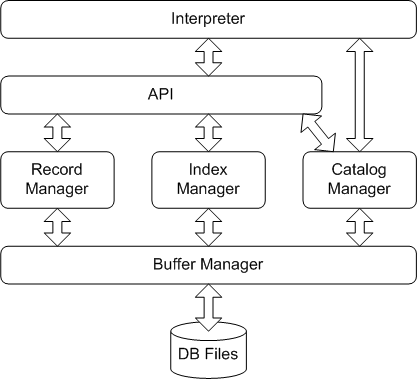

# MiniSQL
This is a very simple database management system with very few features. It is made just for a deeper understanding of how a database works.

## Features
- Support three data types: int, float and char(n) where 1 ≤ n ≤ 255
- Support tables with up to 32 attributes. Support primary key and unique key definition.
- Support indices on unique keys.
- Support six operations for selection and deletion: =, <>, <, >, <= and >=. Operation = can be accelerated by existing indices.
- Support the following instructions:
    - select
    - insert
    - delete
    - create table / index
    - drop table / index
    - exec / execfile (Execute a .sql file)
    - exit / quit

## Example
```
minisql> create table student (
    ...>   sno char(8),
    ...>   sname char(16) unique,
    ...>   sage int,
    ...>   sgender char(1),
    ...>   primary key(sno)
    ...> );
1 table created. Query done in 0s.

minisql> insert into student values ('00001', 'Alice', 17, 'F');
1 record inserted. Query done in 0s.

minisql> insert into student values ('00002', 'Bob', 13, 'M');
1 record inserted. Query done in 0s.

minisql> insert into student values ('00003', 'Bob', 26, 'M');
ERROR: [RecordManager::insert] Duplicate values in unique column `sname` of table `student`!

minisql> insert into student values ('00004', 'Cindy', 25, 'F');
1 record inserted. Query done in 0s.

minisql> insert into student values ('00005', 'Dave', 16, 'M');
1 record inserted. Query done in 0s.

minisql> select * from student;

sno     sname   sage    sgender
----------------------------------------
00001   Alice   17      F
00002   Bob     13      M
00004   Cindy   25      F
00005   Dave    16      M

4 record(s) selected. Query done in 0s.

minisql> select * from student where sno = '00002';

sno     sname   sage    sgender
----------------------------------------
00002   Bob     13      M

1 record(s) selected. Query done in 0s.

minisql> select * from student where sage >= 15 and sage <= 25;

sno     sname   sage    sgender
----------------------------------------
00001   Alice   17      F
00004   Cindy   25      F
00005   Dave    16      M

3 record(s) selected. Query done in 0.016s.

minisql> delete from student where sgender <> 'M';
2 record(s) deleted. Query done in 0s.

minisql> select * from student;

sno     sname   sage    sgender
----------------------------------------
00002   Bob     13      M
00005   Dave    16      M

2 record(s) selected. Query done in 0.016s.

minisql> drop table student;
1 table dropped. Query done in 0.016s.

minisql> exit;
Bye~ :)
```

Test files can be found in the "test" folder.

## Structure
The code structure of MiniSQL can be illustrated by the following figure.



Database files are moved from disk to memory by the Buffer Manager, which adopts an LRU block replacement strategy.

Catalog Manager maintains the information of each table and index, such as attribute numbers, attribute names.

Record Manager maintains records in each table. It also provides a brute-force record searching method.

Index Manager maintains existing indices. It is an interface for the underlying B+ tree index structure.

API is the interface for the whole database management system. It will call each manager in a specific order to finish an operation.

Interpreter is the bridge between the database and its users. It interprets the SQL commands and asks API to perform desired operations.

Helper classes such as HeapFile or Table are omitted.

## Build from source
To build MiniSQL from source, just go into the root folder of this project, and run `make` in the command line. An executable file "minisql.exe" will be generated. You can then run `minisql` in the command line to start MiniSQL.

As I'm using Windows to develop this project, I can only provide Windows Makefile. If you are interested, please feel free to contribute Linux or Mac Makefile.